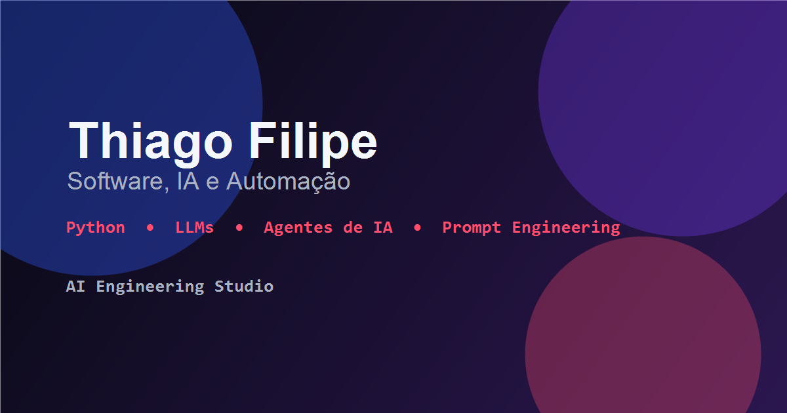

<p align="center">
  
</p>

<h1 align="center">Thiago Filipe Portfolio</h1>

<p align="center">
  One-page bilingual portfolio focused on software development, Python, GenAI, LLMs, AI agents and practical projects.
</p>

<p align="center">
  
  
  
  
  
  
  
</p>

## Quick Links

- Live demo: pending GitHub Pages deployment
- GitHub: [github.com/th1agx](https://github.com/th1agx)
- LinkedIn: [linkedin.com/in/thiagofilipeantunes](https://www.linkedin.com/in/thiagofilipeantunes)
- Resume PDF: [public/curriculo-thiago-filipe.pdf](public/curriculo-thiago-filipe.pdf)
- Repository: pending final GitHub repository URL

## About

This project is a professional one-page portfolio built to present my work, experience, technical stack, certifications, resume and contact links in a more curated way than a raw GitHub profile.

The portfolio highlights my current positioning around software development, Python, generative AI, LLMs, AI agents, Prompt Engineering, automation, API integrations and practical projects.

The site is bilingual, currently supporting Portuguese and English without internal routes or separate pages.

> Portuguese note: este portfólio foi criado para apresentar projetos, experiência e currículo de forma mais visual, profissional e objetiva para recrutadores e visitantes técnicos.

## Features

- One-page layout with anchor navigation
- Portuguese and English language toggle
- Language preference saved in `localStorage`
- Smooth navigation between sections
- Animated section reveals with Framer Motion
- Project cards with drawer-based details
- Honest project previews, including conceptual previews and real screenshots where available
- Resume download/open link
- Responsive desktop and mobile layout
- GitHub Pages-ready deployment setup
- Basic SEO and Open Graph metadata
- Accessible controls, visible focus styles and `prefers-reduced-motion` support

## Tech Stack

**Frontend**

- React
- TypeScript
- Vite

**Styling**

- Tailwind CSS
- Custom theme colors
- Global CSS animations and accessibility fallbacks

**Motion**

- Framer Motion

**Deploy**

- GitHub Pages
- GitHub Actions workflow
- `gh-pages` deployment script

**Tooling**

- ESLint
- Playwright for local visual validation

## Project Structure

```txt
src/
  assets/
    projects/          # Real screenshots and project preview assets
  components/          # Reusable UI components
  data/                # Content, translations, projects and links
  sections/            # One-page portfolio sections
  App.tsx              # Main app composition
  index.css            # Tailwind layers and global visual system

public/
  curriculo-thiago-filipe.pdf
  favicon.svg
  og-image.png
  profile/
    thiago-filipe.jpeg

.github/
  workflows/
    deploy.yml         # GitHub Pages deployment workflow
```

## Getting Started

Install dependencies:

```bash
npm install
```

Run the development server:

```bash
npm run dev
```

## Build

Create a production build:

```bash
npm run build
```

Preview the production build locally:

```bash
npm run preview
```

## Deploy

This project is prepared for GitHub Pages deployment in two ways.

### Option A: Deploy with `gh-pages`

```bash
npm run deploy
```

This runs the build through `predeploy` and publishes the `dist/` folder.

### Option B: Deploy with GitHub Actions

1. Push this project to a GitHub repository.
2. Open the repository settings.
3. Go to `Settings > Pages`.
4. Set the source to `GitHub Actions`.
5. Push to `main` or run the workflow manually.

The workflow file is available at [.github/workflows/deploy.yml](.github/workflows/deploy.yml).

## Content Management

Most portfolio content is stored as static TypeScript data:

- Texts and translations: [src/data/i18n.ts](src/data/i18n.ts)
- Projects and preview metadata: [src/data/projects.ts](src/data/projects.ts)
- Contact and external links: [src/data/links.ts](src/data/links.ts)
- Shared data types: [src/data/types.ts](src/data/types.ts)
- Skills source placeholder: [src/data/skills.ts](src/data/skills.ts)
- Experience source placeholder: [src/data/experience.ts](src/data/experience.ts)
- Certifications source placeholder: [src/data/certifications.ts](src/data/certifications.ts)

The project intentionally uses static data instead of the GitHub API to keep editorial control, visual consistency and reliable GitHub Pages deployment.

## Project Previews

Project previews are handled honestly:

- Some previews are conceptual and are labeled as conceptual/workflow previews.
- Some previews use real screenshots captured from local static projects.
- Conceptual visuals are not presented as real product screenshots.
- Project preview assets live under [src/assets/projects](src/assets/projects).

Current real screenshots:

- Product Management project
- Secret Number Game project

Current conceptual previews:

- DevGuard Skill workflow
- Forza Auto Drive technical terminal preview
- Gym Management CLI/GUI conceptual preview
- Web Development low-emphasis preview

## Current Status

Functional initial version, with bilingual content, animated sections, responsive layout, project cards, drawer details, resume link, SEO basics and GitHub Pages deployment setup.

Final production polish is still in progress, especially around real project screenshots, README improvements in related repositories and post-deploy Lighthouse validation.

## Roadmap

- Publish the live version on GitHub Pages
- Add final repository URL to this README
- Add more real screenshots or short GIFs for selected projects
- Improve READMEs for the featured project repositories
- Run Lighthouse after deployment
- Refine Open Graph image after final visual review
- Add a custom domain in the future
- Continue improving motion based on real user feedback

## License

No `LICENSE` file is currently included.

Suggested license for this portfolio project: MIT. Add a `LICENSE` file before marking the project as MIT-licensed.

## Contact

**Thiago Filipe**

- GitHub: [https://github.com/th1agx](https://github.com/th1agx)
- LinkedIn: [https://www.linkedin.com/in/thiagofilipeantunes](https://www.linkedin.com/in/thiagofilipeantunes)
- Email: [thiagofsprofissional@gmail.com](mailto:thiagofsprofissional@gmail.com)
